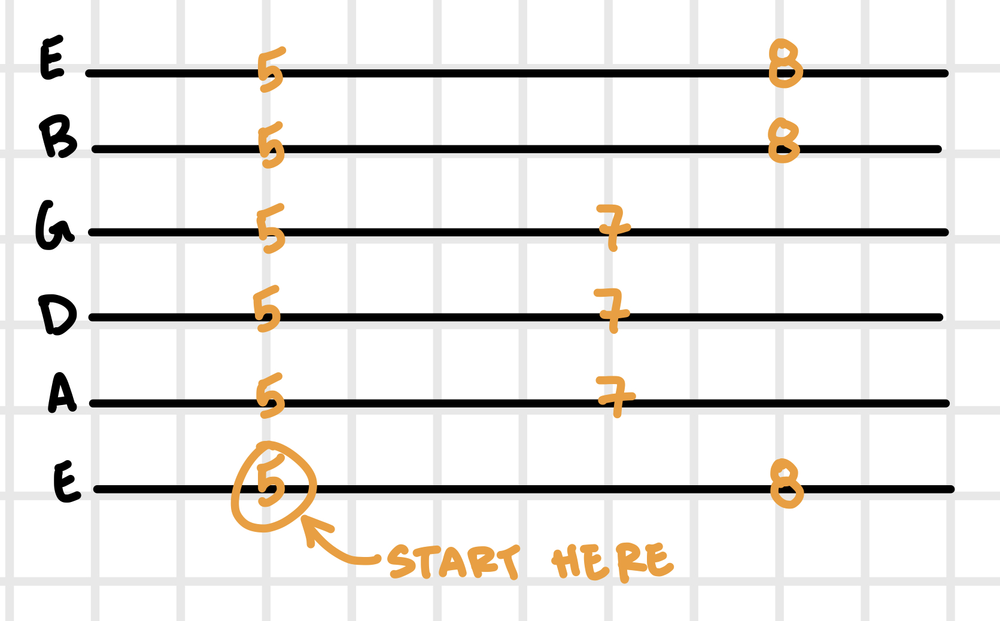

# Lesson 01

Date: September 26, 2022

## Warm Up

Warm up by playing four consecutive notes on each string starting with the low-e string. Once you have played this sequence on each string, move up a fret and play four notes in the reverse order and from the high-e string down. 

Ex: 

`1,2,3,4` up the strings, `5,4,3,2` down, `3,4,5,6` back up, etc. Continue this partern until you finish `9,10,11,12` up the strings. 

[Demo](https://youtu.be/IEGEyB3cAo4)

## Pentatonic Scale

#### Exercise 1: Single Notes

Move up and down the scale while playing one note at a time

#### Exercise 2: Stagger 3rd String

Play each note for three strings at a time. Once you have completed the 3rd string, go back to the previous string and continue the pattern from there. 

#### Exercise 3: Stagger 3rd Note

Play three notes at a time. After th 3rd note, go back a note and continue the pattern from there.

[Demo](https://youtu.be/IUlmHH9BxJA)

## General Notes

Practice alternative picking (up, down) in each exercise

Keep hand in a claw formation. i.e, try to keep thumb perpendicular with neck instead of parellel.

