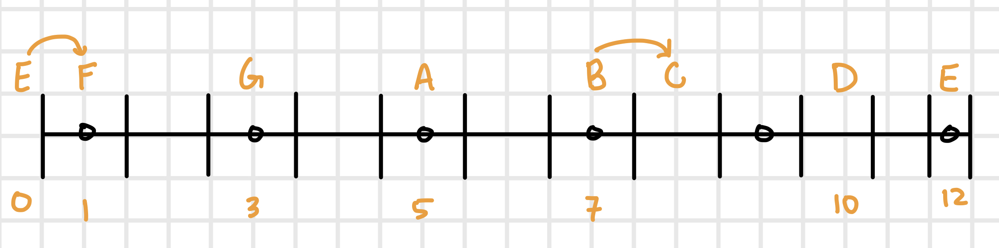
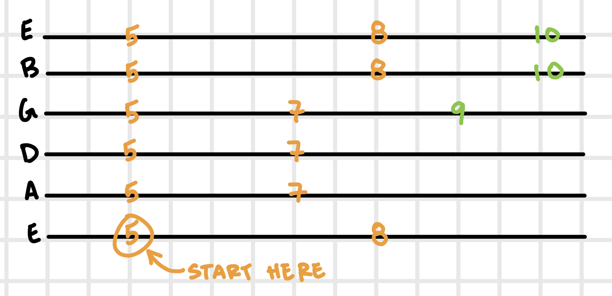
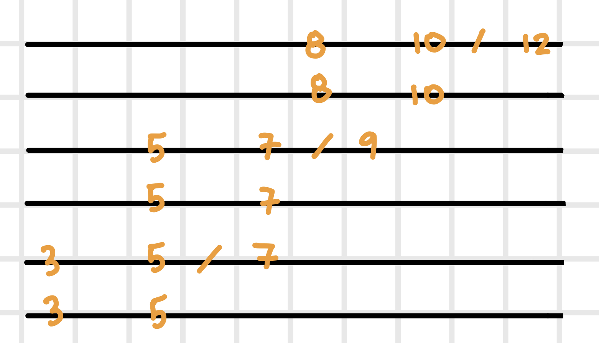

# Lesson 02

Date: October 3, 2022

## Warm Up

Continue doing `1,2,3,4, 5,4,3,2, 3,4,5,6` pattern discussed in lesson 1.

Continue practicing pentatonic scale and the lessons discussed in lesson 1.

## Learn Notes on Low E String

Open string = E

Each fret is considered a "half step". Most minor notes are two steps (or frets) apart. Minor notes that are only separated by a single step (fret) are indicated with an arrow.

## Learn Basic Bends on the Pentatonic Scale

The notes in green harmonically fit in the pentatonic scale. Practice bending strings to reach the sound of the next note. For example, Practice bending the note on fret 7 of the 3rd string to the sound of the note on fret 9 of the same string. 

[Demo](https://youtu.be/_KbnvfGzCnM)
## Learn the "Sliding Scale"

`/ = slide`