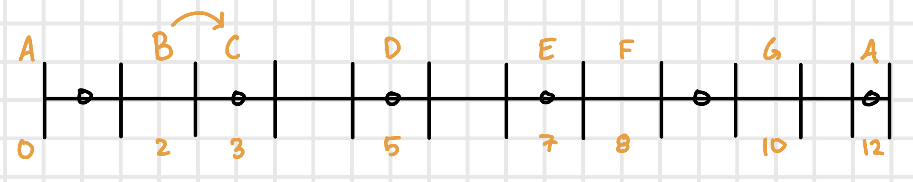

# Lesson 03

Date: October 17, 2022

## Warm Up

Continue doing `1,2,3,4, 5,4,3,2, 3,4,5,6` pattern discussed in lesson 1.

* Make sure fingers are being curled
* Keep fingers on string while playing up the string
* Try to play right behind frets
  
Continue practicing pentatonic scale and the lessons discussed in lesson 1.

## Learn A String Notes

## General Notes

Review and keep practicing Bends + Sliding Scale from week 2